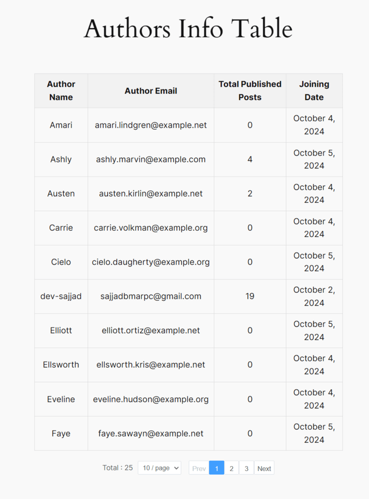

# Authors Info Table Plugin

Authors Info Table is a WordPress plugin that provides a efficient way to display information about all authors on your WordPress site. It generates a table showcasing author details including their name, email, total published posts, and joining date, complete with pagination for easy navigation.
## Screenshot




## Usage
This shortcode can be used anywhere in your website page, post or text widget to view the authors table.

```
[author_info_table]
```


## Features

- Clean, tabular display of author information
- Pagination with customizable number of authors per page
- AJAX - for smooth, seamless user experience
- Easy implementation using a simple shortcode


## Installation

Download this repository and add suffix  `.zip` to the folder name. For example: `authors-info-table-plugin.zip`.


## Author

Developed by [dev-sajjad](https://github.com/dev-sajjad)

